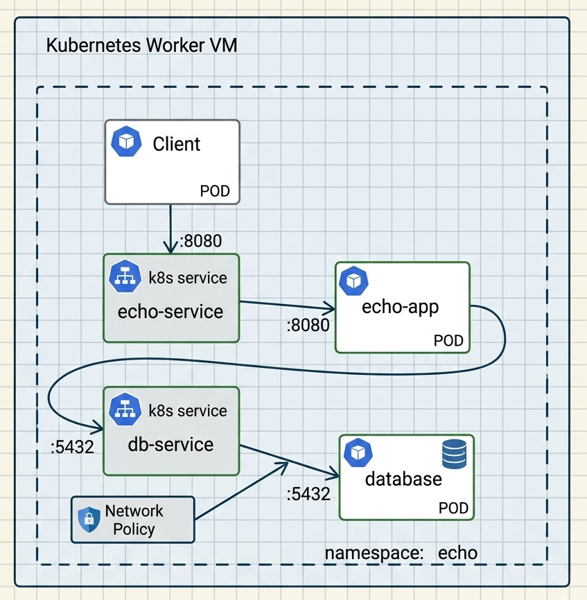

# Simple Kubernetes demo

## Test environment diagram

## Test environment preparation

Option 1:
- [O'Reilly Sandbox](https://www.oreilly.com/)

Option 2:
- [Self-hosted Single VM K3s cluster](01_k3s-installation/README.md)

## Simple 'echo' application
[Multi-POD application](02_echo-application/README.md)

## Self healing
[POD vs Deployment](03_self-healing/README.md)

## Scaling
[Vertical vs horizontal scaling](04_scaling/README.md)

## Network policies
[Network traffic security](05_network-policies/README.md)
