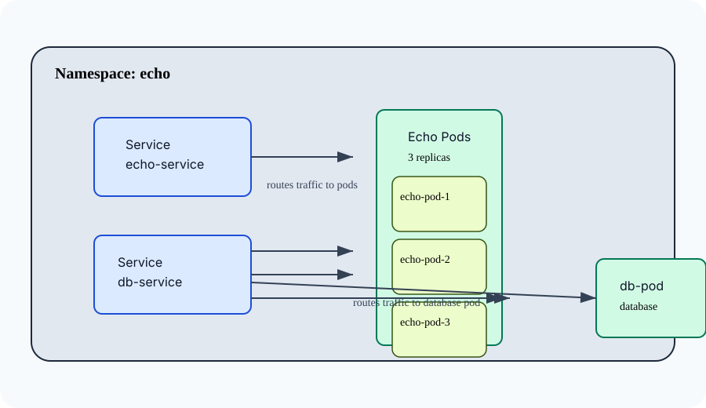

# Simple Kubernetes demo

## Environment preparation

Option 1:
- O'Reilly K8s Sandbox

Option 2:
- Single VM K3s installation

## Simple 'echo' application

### Test environment diagram

This diagram shows the `echo` namespace in Kubernetes with:
- an `echo-service` routing to 3 `echo` application pods
- a `db-service` routing to a single database pod

## Self healing

## Scaling

## Network policies
